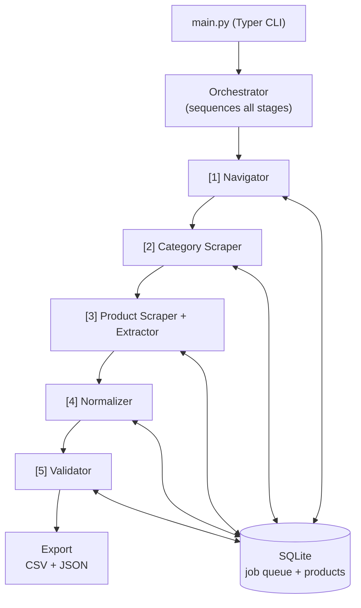

# AI Agent for Product Scraping and Structured Catalog Extraction

An AI-powered ETL pipeline that extracts structured product catalog data from Safco Dental Supply (safcodental.com). Built as a proof-of-concept for Frontier Dental's competitive intelligence workflow.

## Architecture Overview



Each agent is independent and communicates only through SQLite. Killing and restarting the pipeline resumes from the last completed stage.

### Agent Details


- Stage
- Agent
- LLM
- Tools
- Responsibility
---
- 1
- **Navigator**
- No
- `httpx`, `xml.etree`
- Parses `catalog.xml` / `products.xml` sitemaps; filters to target categories; populates the job queue
---
- 2
- **Category Scraper**
- No
- `httpx`, `BeautifulSoup`
- Fetches category pages via HTTP; extracts product URLs and partial metadata from JSON-LD structured data
---
- 3
- **Product Scraper**
- No
- `Playwright`, `tenacity`
- Renders JS-heavy product pages with a headless browser; retries on timeout; passes raw HTML to the Extractor
---
- 3
- **Extractor**
- Fallback only
- `BeautifulSoup` (primary), `LiteLLM` (fallback)
- CSS selector extraction is primary; LLM `tool_use` activates only when selectors return empty
---
- 4
- **Normalizer**
- Yes
- `LiteLLM`
- Normalizes `unit_size` into a canonical form (e.g. `"bx/100"` → `"100/box"`) and infers `specifications` attributes from context — reasoning that `"X-small"` is a `Size`, `"#15C"` is a `Shape`, `"Latex"` is a `Material`, etc.
---
- 5
- **Validator**
- Yes
- `LiteLLM`
- Ensures specification attribute idempotency across LLM batches — detects when the same attribute was labelled differently (e.g. `"Shape"` vs `"Blade"`) and normalizes to one canonical key per attribute. Falls back to most-frequent-key selection when no API key is set.


## Why This Approach

**Agent-based architecture** -- Each stage is an independent agent with a single responsibility. Agents communicate through a shared SQLite database rather than direct calls, which makes the pipeline resumable (kill and restart from where it left off) and observable (query the DB to see progress at any time).

**CSS selectors as primary extraction** -- For the known Magento/Hyva DOM structure, CSS selectors are fast, free, and deterministic. The LLM fallback only activates when selectors return empty results, keeping the hot path cost-free.

**Sitemap-first discovery** -- Rather than spidering the site, the pipeline reads `catalog.xml` and `products.xml` directly. This is faster, respects `robots.txt`, and gives a complete URL inventory without pagination concerns.

**LLM usage decisions** -- AI is used only where deterministic code would be brittle or unmaintainable:


- Agent
- LLM at Runtime
- [Built with Coding Agent](#how-i-use-ai-tools-in-development)
- Rationale
---
- Navigator
- No
- Yes — sitemap XML as ground truth
- The sitemap XML has a fixed, machine-readable schema. `xml.etree` parses it in milliseconds with 100% reliability and zero cost. An LLM would add latency, API cost, and non-determinism to a task a parser solves perfectly — unnecessary complexity with no upside.
---
- Category Scraper
- No
- Yes — sitemap XML as ground truth
- JSON-LD is structured data designed to be consumed by machines. Parsing it with an LLM would be the equivalent of using a language model to parse JSON — adding cost and the risk of hallucination to a task a JSON parser handles exactly and for free.
---
- Product Scraper
- No
- Yes — sitemap XML as ground truth
- Navigating to a URL and returning rendered HTML is a deterministic browser operation. There is no ambiguity for an LLM to resolve — it cannot render JavaScript, and adding one here would introduce cost and complexity with no practical benefit.
---
- Extractor
- Fallback only
- Yes — `products_example_output.csv` as ground truth
- CSS selectors are fast, free, and deterministic for the known Magento/Hyvä DOM. Routing every page through an LLM would add significant cost and latency to the hot path unnecessarily. The LLM fallback is reserved for the cases where the DOM returns nothing — where a rules-based approach has genuinely failed and reasoning over layout intent is the only way to recover.
---
- Normalizer
- Yes
- Yes
- Unit size strings appear in hundreds of manufacturer-specific formats (`"bx/100"`, `"per box of 100"`, `"Box 100ct"`, `"1 vial, 2.5ml"`) across 80+ product categories. A regex approach would require hundreds of patterns, break on new formats, and still miss edge cases — high maintenance cost for low reliability. The LLM normalizes all variations correctly with a single prompt and handles dental industry conventions without explicit rules. Specification attribute inference (recognising `"X-small"` as `Size`, `"#15C"` as `Shape`) cannot be done with regex at all — it requires understanding context.
---
- Validator
- Yes
- Yes
- The Normalizer runs in batches and is non-deterministic — the same attribute can be labelled `"Shape"` in one batch and `"Blade"` in another. Exact string matching would miss these semantic aliases entirely. The LLM adds practical value here because it understands that `"Blade"` and `"Shape"` refer to the same attribute in the context of dental instruments, where a rules-based approach would leave the inconsistency unresolved and corrupt cross-variant queries.


## Usage

### Prerequisites

- Python 3.11+
- An OpenRouter API key (for LLM steps)

### Installation

```bash
# Clone the repository
git clone github.com/AlexPerrin/AI-Agent-for-Product-Scraping-and-Structured-Catalog-Extraction-POC/edit/main/README.md
cd AI-Agent-for-Product-Scraping-and-Structured-Catalog-Extraction-POC

# Create virtual environment
python -m venv venv
source venv/bin/activate  # Linux/Mac
# or: venv\Scripts\activate  # Windows

# Install dependencies
pip install -r requirements.txt

# Install Playwright browser
playwright install chromium

# Configure environment
cp .env.example .env
# Edit .env and add your OPENROUTER_API_KEY
```

### Running the Pipeline

```bash
# Full pipeline run
python main.py run

# Fresh start (clears all existing data)
python main.py run --reset

# Override target categories
python main.py run --categories sutures-surgical-products --categories gloves

# Cap the number of product pages scraped (useful for testing)
python main.py run --limit 20

# Skip browser rendering (only run discovery + category scraping)
python main.py run --skip-browser

# Export only (no scraping, just generate CSV/JSON from existing data)
python main.py run --export-only

# Check pipeline status
python main.py status

# Re-run normalizer on already-extracted data and export
python main.py normalize

# Re-run validator (spec key harmonization) on normalized data and export
python main.py validate

# Export existing data
python main.py export
```

### Sample Log Output

Each pipeline stage emits structured logs via `structlog`. Below is a representative sample from a full run ([full log](output/log.txt)):

```text
(venv) alex@alex-desktop:~/Frontier-Dental-POC$ python main.py run --reset --limit 100

2026-03-17T19:39:16.188371Z [info ] orchestrator_start              export_only=False product_limit=100 reset=True skip_browser=False
2026-03-17T19:39:16.191690Z [info ] database_initialised            path=frontier_dental.db
2026-03-17T19:39:16.241042Z [info ] database_reset
2026-03-17T19:39:16.241100Z [info ] stage_navigator
2026-03-17T19:39:16.241153Z [info ] navigator_start
2026-03-17T19:39:16.559481Z [debug] sitemap_parsed                  count=314 url=https://www.safcodental.com/catalog.xml
2026-03-17T19:39:16.672958Z [debug] sitemap_parsed                  count=4168 url=https://www.safcodental.com/products.xml
2026-03-17T19:39:16.674216Z [info ] navigator_categories_filtered   matched=16 total=314
2026-03-17T19:39:17.123707Z [info ] navigator_complete              category_jobs=16 product_jobs=4168

2026-03-17T19:39:17.123833Z [info ] stage_category_scraper
2026-03-17T19:39:17.134591Z [info ] category_scraper_start
2026-03-17T19:39:17.135066Z [info ] category_scraper_pending_jobs   count=16
2026-03-17T19:39:17.135128Z [debug] http_get_no_raise               url=https://www.safcodental.com/catalog/gloves
2026-03-17T19:39:30.221981Z [debug] category_scraped                products_found=56 url=https://www.safcodental.com/catalog/gloves
2026-03-17T19:40:41.777594Z [info ] category_scraper_complete       processed=16 skipped_404=0

2026-03-17T19:40:41.778307Z [info ] stage_product_scraper_extractor
2026-03-17T19:40:41.784187Z [info ] product_extraction_limit_applied limit=100
2026-03-17T19:40:41.784245Z [info ] product_extraction_start        job_count=100
2026-03-17T19:40:42.461822Z [info ] browser_started
2026-03-17T19:40:42.584409Z [debug] browser_navigate                url=https://www.safcodental.com/product/wire-glove-box-holder
2026-03-17T19:40:45.945113Z [debug] browser_live_dom_extracted      url=https://www.safcodental.com/product/wire-glove-box-holder variant_count=3
2026-03-17T19:40:46.009440Z [debug] browser_rendered                size=612164 url=https://www.safcodental.com/product/wire-glove-box-holder
2026-03-17T19:40:46.056047Z [info ] extractor_css_success           url=https://www.safcodental.com/product/wire-glove-box-holder variant_count=3
2026-03-17T19:42:40.082515Z [info ] browser_stopped
2026-03-17T19:42:40.082574Z [info ] product_extraction_complete

2026-03-17T19:42:40.082599Z [info ] stage_normalizer
2026-03-17T19:42:40.082620Z [info ] normalizer_start
2026-03-17T19:42:41.211875Z [info ] normalizer_batch                size=200
2026-03-17T19:43:43.286929Z [info ] normalizer_complete             total_normalized=457

2026-03-17T19:43:43.287022Z [info ] stage_validator
2026-03-17T19:43:43.287082Z [info ] validator_start
2026-03-17T19:43:44.512172Z [info ] validator_key_mismatch          group='Myco Medical RELI® PRO Sutures' renames={'Blade': 'Blade Type', 'Needle': 'Needle Type'}
2026-03-17T19:43:45.941984Z [info ] validator_complete              groups=99 products=457 specs_fixed=20

2026-03-17T19:43:45.942142Z [info ] stage_export
2026-03-17T19:43:45.956438Z [info ] exported_csv                    path=output/products.csv record_count=457
2026-03-17T19:43:45.969260Z [info ] exported_json                   path=output/products.json record_count=457
2026-03-17T19:43:45.969448Z [info ] export_complete                 csv=output/products.csv json=output/products.json
2026-03-17T19:43:45.970497Z [info ] pipeline_summary                elapsed_seconds=269.8 total_records=512 valid=457 warning=0 invalid=0 css_selector=457 llm_fallback=0 llm_fallback_rate_pct=0.0 json_ld=55
```

## Sample Outputs

Full output files from a run across both target categories (64 products) are available for download:

- [products.csv](output/products.csv)
- [products.json](output/products.json)
- [products.xlsx](output/products.xlsx)

### JSON

```json
{
  "product_group_name": "Nuvo™",
  "product_name": "Nuvo vinyl gloves small 100/box",
  "brand": "Dash",
  "item_number": "4680227",
  "manufacturer_number": "NV100S",
  "category_hierarchy": ["Dental Supplies", "Dental Exam Gloves", "Vinyl gloves"],
  "product_group_url": "https://www.safcodental.com/product/nuvo-trade",
  "price": {"1": "7.49"},
  "unit_size": "100/box",
  "specifications": {"Size": "Small"},
  "availability": "In stock",
  "description": "Powder-free vinyl examination gloves.",
  "image_urls": ["https://www.safcodental.com/media/catalog/product/d/r/druii_lc.jpg"],
  "scraped_at": "2026-03-17T19:40:46.197745",
  "extraction_method": "css-selector",
  "validation_status": "valid",
  "validation_notes": null
}
```

### CSV


- product_group_name
- product_name
- brand
- item_number
- manufacturer_number
- category_hierarchy
- product_group_url
- Quantity
- price_per_unit
- availability
- group_description
- unit_size
- specifications
- image_urls
- scraped_at
- extraction_method
- validation_status
- validation_notes
---
- Nuvo™
- Nuvo vinyl gloves small 100/box
- Dash
- 4680227
- NV100S
- Dental Supplies / Dental Exam Gloves / Vinyl gloves
- `https://…/nuvo-trade`
- 1
- $7.49
- In stock
- Powder-free vinyl examination gloves.
- 100/box
- `{"Size": "Small"}`
- `https://…/druii_lc.jpg`
- 2026-03-17T19:40:46
- css-selector
- valid
- 


## Output Schema

One row per orderable variant (SKU). Both CSV and JSON exports use this schema:


- Field
- Type
- Description
---
- `product_group_name`
- `string`
- Name of the product group (parent listing shared across variants)
---
- `product_name`
- `string`
- Full name of this specific variant
---
- `brand`
- `string`
- Manufacturer or brand name
---
- `item_number`
- `string`
- Safco item number (unique per variant)
---
- `manufacturer_number`
- `string`
- Manufacturer's own part number
---
- `category_hierarchy`
- `string[]` / `string`
- Breadcrumb path from root to leaf category (array in JSON, `/`-separated in CSV)
---
- `product_group_url`
- `string`
- URL of the product page on safcodental.com
---
- `price`
- `object` / `string`
- Quantity-tier pricing; keys are minimum order quantities, values are unit prices (e.g. `{"1": "7.49", "6": "6.99"}`). Flattened to `Qty 1: $7.49 | Qty 6: $6.99` in CSV.
---
- `unit_size`
- `string`
- Normalised pack size in canonical form (e.g. `100/box`, `2.5ml/vial`, `1`)
---
- `specifications`
- `object` / `string`
- LLM-inferred variant attributes such as `Size`, `Material`, `Shape`, `Color`, `Dimensions`. Empty object when no distinguishing attributes exist. Serialised as a JSON string in CSV.
---
- `availability`
- `string`
- Stock status as shown on the product page (e.g. `In stock`, `Backorder`)
---
- `description`
- `string`
- Product description
---
- `image_urls`
- `string[]` / `string`
- Product image URLs (array in JSON, pipe-separated in CSV)
---
- `scraped_at`
- `string` (ISO 8601)
- Timestamp of when the product page was scraped
---
- `extraction_method`
- `string`
- `css-selector` or `llm-fallback` — indicates which extraction path was used
---
- `validation_status`
- `string`
- `valid` for all records after validator runs
---
- `validation_notes`
- `string | null`
- Additional notes from the validator, if any


## Limitations

1. **No proxy rotation.** Requests come from a single IP. High-volume runs may trigger rate limiting.
1. **Playwright is slow.** Rendering JS-heavy Magento pages takes 2-5 seconds each vs ~100ms for static HTTP. The POC scope (two categories) is manageable; full-site crawls need distributed browser workers.
1. **LLM fallback adds cost.** If CSS selectors degrade across many pages (e.g., after a site redesign), LLM calls become expensive. The `extraction_method` metric provides early warning.
1. **No image downloading.** Image URLs are stored, not the images themselves.
1. **Category membership is sitemap-inferred.** Products are assigned to categories based on sitemap discovery. Cross-listed products only get their first category association.
1. **Single-process execution.** The pipeline runs in one process with async concurrency. Production scale requires distributed workers.

## Failure Handling


- Failure Mode
- How It Is Handled
---
- HTTP 404 on category page
- Job marked `skipped_404`, logged, pipeline continues
---
- HTTP error / timeout
- Retried 3 times with exponential backoff (1s, 2s, 4s via tenacity)
---
- Playwright navigation timeout
- Retried 2 times, then job marked `tier2_failed` with error details
---
- CSS selectors return empty
- Automatic fallback to LLM extraction
---
- LLM API error (normalizer)
- Logged, batch skipped, pipeline continues with next batch
---
- LLM returns unparseable JSON
- Logged, batch marked with defaults, pipeline continues
---
- LLM rate limit
- Exponential backoff retry (up to 6 attempts: 15s, 30s, 60s, 120s, 240s, 480s)
---
- LLM API error (validator)
- Falls back to deterministic most-frequent-key selection for that product group
---
- No API key configured
- LLM steps skipped gracefully with warnings; normalizer skips normalization, validator uses deterministic fallback
---
- Pipeline killed mid-run
- Restart picks up from last checkpoint (each job has status in SQLite)
---
- Duplicate products
- `UNIQUE` constraint on `safco_item_number`; upserts update existing records


## How to Scale to Full-Site Crawling

1. **Remove category filtering** -- Set `TARGET_CATEGORIES` to all category slugs or remove the filter entirely in the Navigator agent.
1. **Distributed browser rendering** -- Replace the single Playwright process with a Playwright cluster or Browserless.io pool. The semaphore-based concurrency model already supports this pattern.
1. **Replace SQLite with PostgreSQL** -- Add proper indexing to the products database and use connection pooling (asyncpg) to support concurrent writers across distributed workers.
1. **Implement the job queue with Kafka** -- Decouple the job queue from the products database entirely. Each pipeline stage becomes a Kafka consumer group, publishing completed work as events for the next stage. This enables independent scaling of each stage, persistent replay, and dead-letter handling without coupling job state to the product store.
1. **Integrate structured logging with an observability platform** -- The pipeline already uses `structlog` with structured key-value output. Wire this into Datadog or Grafana to build dashboards and alerts for pipeline performance (throughput, latency per stage, retry rates) and data quality (LLM fallback rate, spec key corrections, extraction failures).
1. **Schedule with Airflow or cron** -- Run differential scrapes (only reprocess products whose content hash changed) on a regular schedule.
1. **Add proxy rotation** -- Configure rotating proxies and user agents to distribute request load across IPs.
1. **Increase rate limits** -- Tune `REQUEST_DELAY` and `BROWSER_CONCURRENCY` based on observed rate limiting behavior.

## How to Monitor Data Quality

1. **LLM fallback rate** -- Track the ratio of `extraction_method="llm-fallback"` records. A rising rate signals CSS selector degradation (site DOM changed). Run `python main.py status` to see current counts.
1. **Spec key harmonization counts** -- The validator logs `specs_fixed` (number of records whose spec keys were renamed for consistency). A high count after a re-run signals the normalizer is producing inconsistent keys, likely due to LLM drift.
1. **Known-page regression tests** -- Maintain a set of 10-20 known product pages with expected output. Run extraction against them after each deploy and alert if results diverge.
1. **Structured logging** -- All pipeline stages use `structlog` with structured key-value output. Ingest logs into Datadog, Grafana, or similar for dashboards and alerting.
1. **Database queries** -- The SQLite database is the source of truth. Query it directly to audit specific records, check job queue health, or investigate extraction failures:

```bash
# Count by extraction method
sqlite3 frontier_dental.db "SELECT extraction_method, COUNT(*) FROM products GROUP BY extraction_method"

# Find LLM fallback records
sqlite3 frontier_dental.db "SELECT item_number, product_name FROM products WHERE extraction_method='llm-fallback'"

# Check failed jobs
sqlite3 frontier_dental.db "SELECT url, error_msg FROM jobs WHERE status='tier2_failed'"

# Check spec key variety across a product group
sqlite3 frontier_dental.db "SELECT product_name, specifications FROM products WHERE product_group_name='Latex Examination Gloves'"
```

## How I Use AI Tools in Development

### Tooling Setup

This project was built using **Claude Code** inside VS Code as the primary coding agent. Two integrations shaped the workflow significantly:

- **Context7 MCP** -- Connected via MCP server, Context7 gives Claude Code access to live library documentation. Rather than relying on potentially stale training data, the agent fetches current docs for libraries like Playwright, LiteLLM, and httpx at the point of code generation. This was particularly useful when working with Playwright's async API, where small version-specific differences in method signatures would otherwise cause silent failures.
- **claude-devtools** -- A local repo used to trace prompt inputs, outputs, and context window contents during development. When an LLM agent (normalizer, validator) was producing unexpected output, claude-devtools made it possible to inspect exactly what prompt was sent, what the model returned, and whether context was being truncated or polluted — without guessing.
- **Plan Mode** -- Before writing any code, Claude Code's Plan Mode was used to produce [PLAN.md](PLAN.md) — a detailed implementation document covering site research, architectural decisions, agent specifications, tech stack rationale, and the production hardening path. Plan Mode shifts the coding agent into a research and design role: rather than immediately generating code, it investigates the problem, and produces a written plan for review before implementation begins. PLAN.md then served as the implementation prompt for the rest of the session — each agent was built by pointing the coding agent at the relevant section of the plan, giving it precise context about expected inputs, outputs, and edge cases.

### Output-First Development for Scraping Agents

For the deterministic agents (Navigator, Category Scraper, Product Scraper, Extractor), the most effective workflow was **providing the desired output before writing the extraction code**. Before implementing the Extractor, `products_example_output.csv` was created by hand with correct field values for a small set of real products — capturing the exact item numbers, prices, unit sizes, and category hierarchies that should appear in the final dataset.

This gave the coding agent a concrete ground truth to work backwards from: instead of reasoning abstractly about what CSS selectors might exist on an unknown page, it could verify its extraction logic against known-correct values.

The main challenge was that safcodental.com uses a Magento/Hyva frontend with heavily JS-rendered product pages. Static HTTP requests returned incomplete HTML with missing prices, variant tables, and specifications. The agent needed to be directed to use **Playwright to fully render each page** before attempting CSS extraction — a non-obvious requirement that only became clear once the expected output values were available for comparison and the raw HTTP responses could be shown to visibly lack them.
